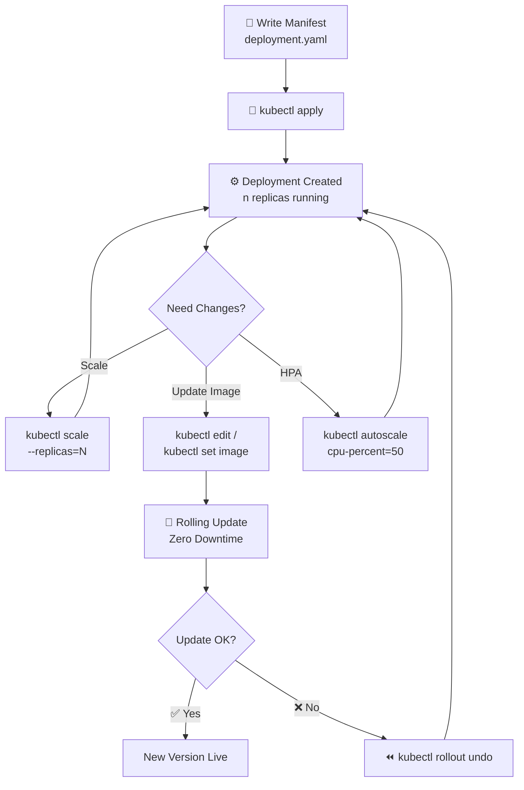
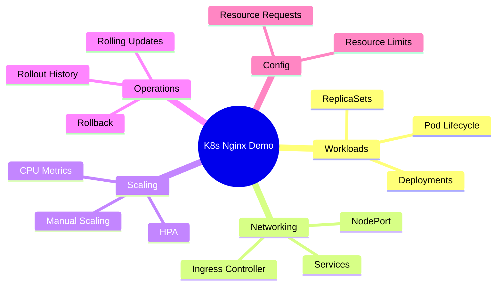

<div align="center">


<br/>

[](/)
[](/)
[](/)
[](/)

<br/>


<br/>

> *A hands-on Kubernetes project covering real-world deployment patterns — from basic pods to autoscaling and rolling updates.*

</div>

---

## 📖 Project Overview

This project deploys a production-style **Nginx application on Kubernetes**, implementing the core patterns used in real DevOps workflows — not just `kubectl run`, but proper manifests with resource management, scaling, and zero-downtime updates.

### Features Implemented

| Feature | Description |
|---|---|
| ⚙️ **Deployment & Service** | Declarative manifest-based deployment |
| 🌐 **NodePort Exposure** | External access via NodePort `30007` |
| 📦 **Resource Limits** | CPU & Memory requests/limits configured |
| 📈 **Manual Scaling** | On-demand replica scaling |
| 🤖 **HPA** | Horizontal Pod Autoscaler (CPU-based) |
| 🔄 **Rolling Updates** | Zero-downtime image upgrades |
| ⏪ **Rollback** | Instant revert to previous version |
| 🚦 **Ingress** | Optional external routing via Ingress controller |

---

## 🗂️ Repository Structure

```
📦 kubernetes-nginx-demo/
├── 📄 deployment.yaml       ← Deployment manifest with resource limits
├── 📄 service.yaml          ← NodePort service
├── 📄 ingress.yaml          ← Optional Ingress config
└── 📄 README.md
```

---

## 🚀 How to Run

### 1 — Deploy the Application

```bash
kubectl apply -f deployment.yaml
kubectl apply -f service.yaml
```

Verify everything is running:

```bash
kubectl get pods
kubectl get svc
```

---

### 2 — Access the App

```
http://localhost:30007/
```

---

### 3 — (Optional) Enable Ingress

```bash
kubectl apply -f ingress.yaml
kubectl port-forward -n ingress-nginx service/ingress-nginx-controller 8080:80
```

Then access via:

```
http://localhost:8080/
```

---

### 4 — Manual Scaling

```bash
# Scale up
kubectl scale deployment nginx-demo --replicas=3

# Verify pods
kubectl get pods -w
```

---

### 5 — Horizontal Pod Autoscaler

```bash
# Create HPA (scales between 1–5 pods at 50% CPU)
kubectl autoscale deployment nginx-demo --cpu-percent=50 --min=1 --max=5

# Monitor HPA
kubectl get hpa -w
```

---

### 6 — Rolling Update

```bash
# Edit the deployment (change image version)
kubectl edit deployment nginx-demo

# Watch the rollout
kubectl rollout status deployment nginx-demo

# View rollout history
kubectl rollout history deployment nginx-demo
```

---

### 7 — Rollback

```bash
# Undo last rollout
kubectl rollout undo deployment nginx-demo

# Rollback to a specific revision
kubectl rollout undo deployment nginx-demo --to-revision=1
```

---

## 🔁 Deployment Lifecycle



---

## 📚 Learning Outcomes



---

## 🧠 Key Concepts Covered

| Concept | What Was Practiced |
|---|---|
| `Deployment` | Declarative pod management with replica control |
| `Service` | Stable network endpoint for pods |
| `NodePort` | Exposing the app outside the cluster |
| `Ingress` | HTTP routing via Ingress controller |
| `Resources` | Setting CPU/memory requests & limits |
| `HPA` | Auto-scaling based on CPU utilisation |
| `Rolling Update` | Updating image with zero downtime |
| `Rollback` | Reverting to a safe previous revision |

---

<div align="center">

[](https://linkedin.com)
[](https://github.com)

*Part of my hands-on Cloud & DevOps learning path.*


</div>
